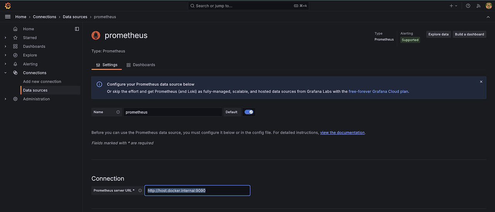
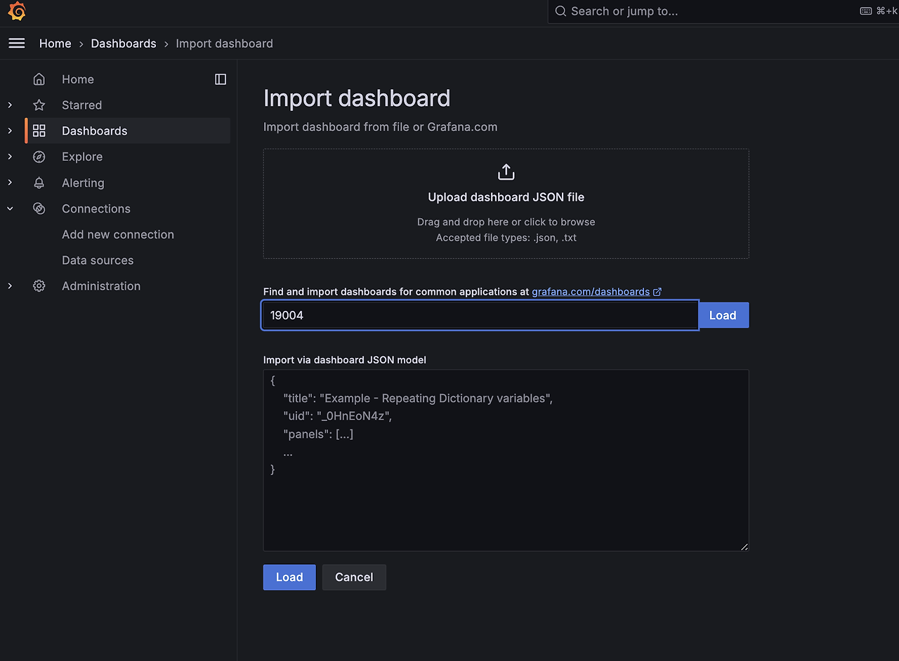
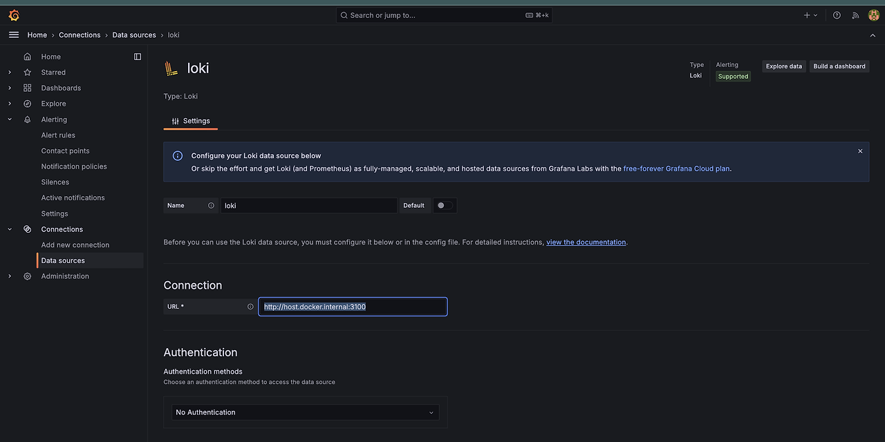

# 📦 Coopang Fulfillment Service 📦


## 🚚 Service Overview
* The Coopang system is based on Microservices Architecture (MSA) and Spring Boot, inspired by Coupang's fulfillment services. It efficiently manages the entire logistics process from inbound to outbound and delivery.
* Designed with a Hub-and-Spoke architecture, items are first routed through a central logistics hub before reaching regional hubs closer to the customer, ultimately ensuring smooth and efficient delivery.


## ✅ How to start
To start the Docker services you defined in your docker-compose.yml file, follow these steps:

### 1. Prerequisites
Ensure both Docker and Docker Compose are installed and running on your machine.

### 2. Navigate to the Project Directory
Move to the directory where your docker-compose.yml file is located.
```bash
cd path/to/your/project
```

### 3. Create the Coopang Network
Before launching the services, create a custom Docker network:

```bash
docker network create coopang
```

### 4. Start the Services
To bring up all services defined in the docker-compose.yml, run the following command:

```bash
docker compose -f docker-compose.yml up -d
```
This starts the containers in detached mode.


### 5. Verify Running Services
After starting the services, verify that all containers are running:

```bash
docker ps -a
```
This will show the list of running containers, including postgres, redis-stack, prometheus, grafana, and loki.

---

## ⚙️ Setting Up Monitoring in Grafana

### 6. Access Grafana
* Navigate to http://localhost:3000 in your browser.
* Default Username: admin
* Default Password: admin

### 7. Add Prometheus as a Data Source in Grafana
1. In Grafana, go to Data Sources.
2. Add a new data source and select Prometheus.
3. For the URL, input:
```http
   http://host.docker.internal:9090
```
   

### 8. Create a Grafana Dashboard
  - Import an existing dashboard or create your own.


For a detailed guide, refer to this blog: -> [Blog: Setting Prometheus in Grafana](https://cutewonny.tistory.com/entry/Grafana)


---
## 🔔 Setting Up Slack Alerts in Grafana
### 9. Setting slack in Grafana
1. Create a Slack app via [SLACK-Developer.](https://api.slack.com/)
2. Set up the bot, select your workspace, and configure it in Grafana.
3. Follow the steps outlined in this blog: -> [Blog: Setting Up Slack in Grafana.](https://cutewonny.tistory.com/entry/grafana-slack-%EC%97%B0%EB%8F%99)


---
## 🔍 Setting Up Loki for Logs in Grafana
### 10. Add Loki as a Data Source in Grafana
1. Go to Data Sources in Grafana.
2. Add a new data source and select Loki.
3. For the URL, input:

```http
   http://host.docker.internal:3100
```


For detailed instructions, refer to this blog:  -> [Blog: Setting Up Loki in Grafana.](https://cutewonny.tistory.com/entry/loki-grafana)

---

### 11. Stopping the Services

```bash
docker-compose down
```
This will stop and clean up all the containers created by the docker-compose file.

