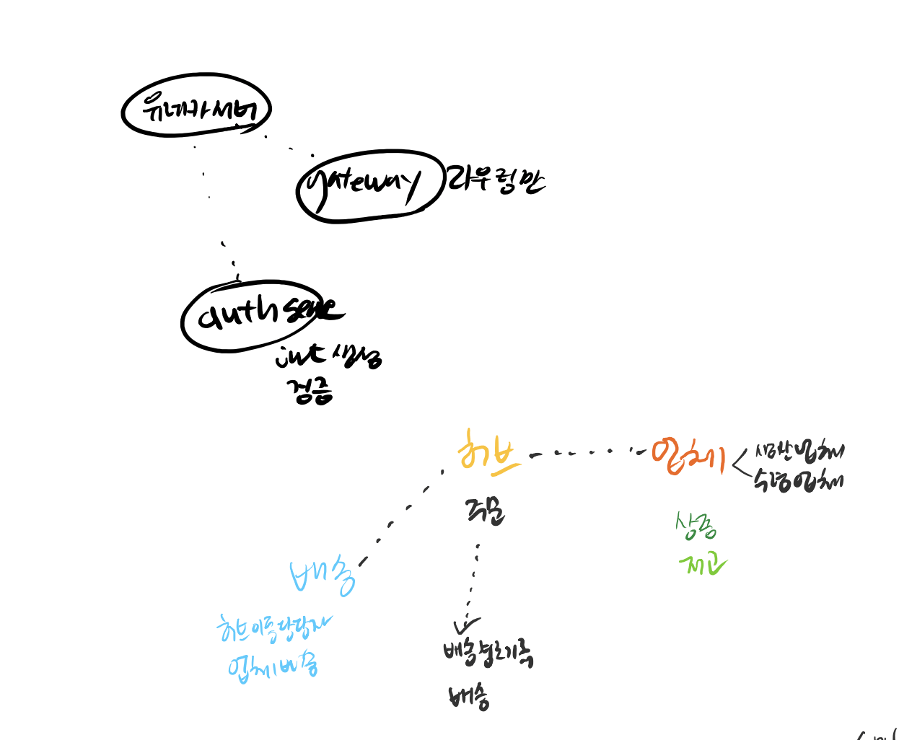

# coopang
물류 관리 및 배송 시스템을 개발하는 것이 목표입니다.  이 과정에서 우리는 MSA(Microservices Architecture) 기반의 시스템을 설계하고 구현하면서, 다양한 기술과 방법론을 적용해 볼 예정

* 테이블 명세서
https://www.notion.so/teamsparta/6816d52d899a4114a1f5329a5d41144d

* API 명세서
https://www.notion.so/teamsparta/API-39038707245040148c02221b33ccd913

* ERD
https://www.notion.so/teamsparta/DB-diagram-0419c7ebaac24e62ae6ee2355a8d0c98

* 인프라 설계서
